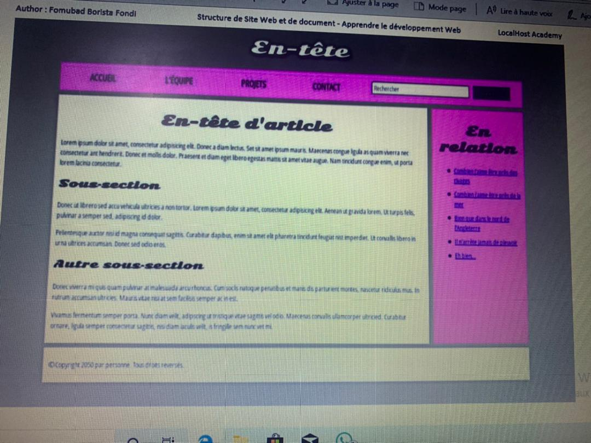

# 
 LocalHost   Tutorial on Html5 and Css 📚

## 📝 Full Description

  The assignment involved evaluating Html5 and CSS. This project helped reinforce understanding of Html tags and how they interact with CSS classes. I gained valuable skills in visual presentation.   

  
## ⚙ Built Using
* [HTML5](https://www.w3schools.com/html/)
* [CSS](https://www.w3schools.com/css/default.asp)
* [VS Code](https://code.visualstudio.com/Download)

  
## 🗂 Design

## 👨‍💻 Author
<b><i>Taku Collins Ayamba</b></i>

